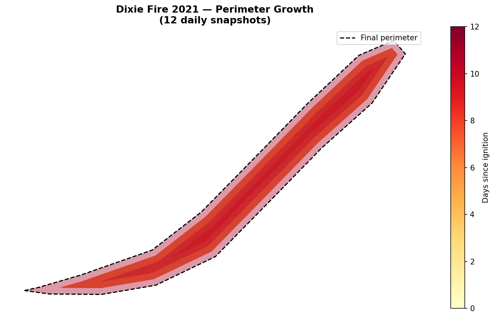
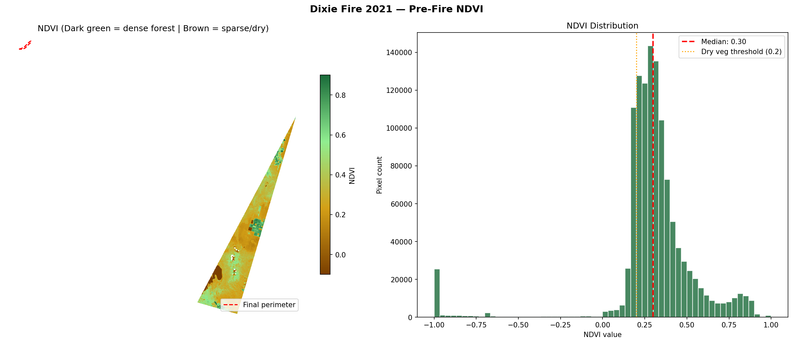
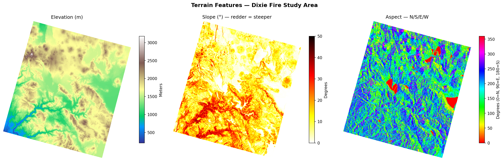
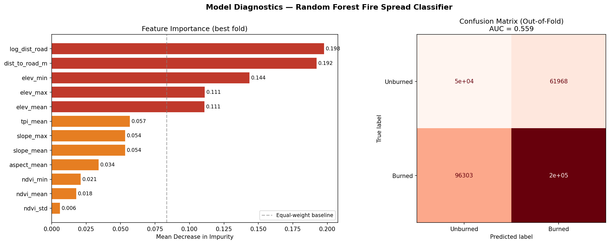
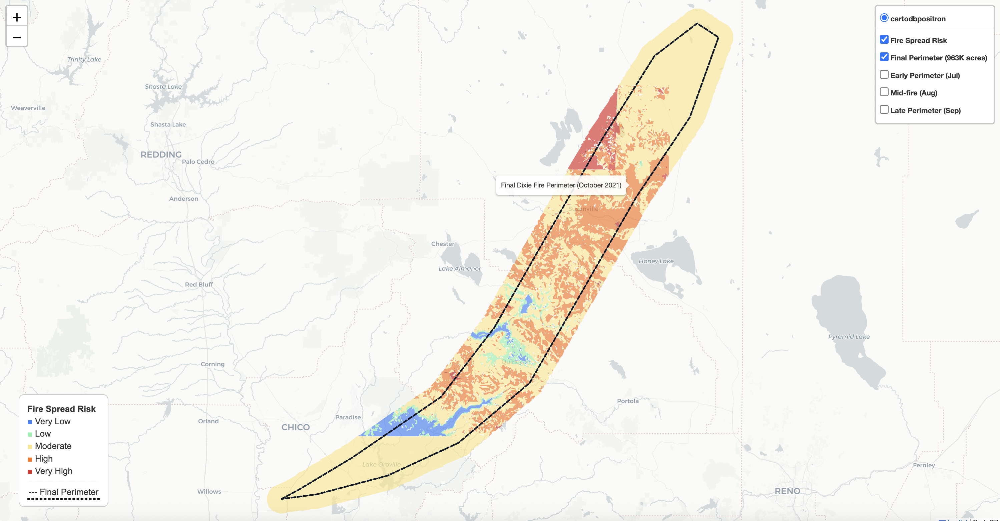

# Wildfire Perimeter Growth Prediction

An end to end geospatial machine learning pipeline that predicts spread risk for the 2021 Dixie Fire in Northern California. The notebook downloads fire perimeter records, satellite vegetation data, terrain data, and road network data, builds a 30 meter analysis grid over the fire area, labels grid cells as burned or unburned from consecutive perimeter snapshots, engineers features from the raster layers, and trains a spatially cross validated Random Forest classifier to produce a wall to wall fire risk map.

## Headline Result

* Mean AUC ROC across 5 fold spatial cross validation: 0.587 (standard deviation 0.109)
* Mean F1 score: 0.674
* 27.8 percent of the fire's actual burned area fell inside grid cells the model labeled High or Very High risk
* Top predictor by importance: distance to nearest road (a common proxy for human ignition risk)

### A note on data completeness

These numbers were produced using a cached, single tile NDVI raster rather than a full multi tile mosaic, because generating the full mosaic requires an interactive NASA Earthdata login that was not available when this run was executed. As a result, roughly 96 percent of grid cells had their NDVI value filled in with the training set median rather than a real measurement, which weakens one of the most physically important wildfire spread predictors. The pipeline includes an automatic check that detects this exact situation and prints a warning telling the user to delete the cached file and rerun with real credentials. Rerunning the vegetation download step with authenticated access is expected to noticeably improve on the numbers above.

## Data Sources

* Fire perimeters: National Interagency Fire Center (NIFC), WFIGS Interagency Perimeters. Public domain, US government data.
  https://data-nifc.opendata.arcgis.com/datasets/nifc::wfigs-current-interagency-fire-perimeters
* Vegetation index (NDVI): NASA Harmonized Landsat Sentinel 2 (HLS), accessed through the earthaccess library. Public domain, NASA open data policy.
  https://lpdaac.usgs.gov/products/hlsl30v002/
* Terrain and elevation: USGS 3D Elevation Program (3DEP), accessed through py3dep. Public domain, US government data.
  https://www.usgs.gov/3d-elevation-program
* Road network: OpenStreetMap, accessed through osmnx. Open Database License (ODbL). Map data copyright OpenStreetMap contributors.
  https://www.openstreetmap.org/copyright

## Method Summary

1. Download the final Dixie Fire perimeter and a series of daily or near daily perimeter snapshots from NIFC.
2. Build a regular 30 meter grid covering the fire footprint plus a buffer zone.
3. Label grid cells burned or unburned by comparing consecutive perimeter snapshots, sampling unburned cells near the fire front so the training set is not dominated by trivially unburned cells far from the fire.
4. Extract zonal statistics from four raster layers for every labeled cell: NDVI, elevation, slope, and aspect. Add a topographic position index and distance to nearest road.
5. Train a Random Forest classifier and evaluate it with spatial cross validation, where folds are defined by KMeans clusters of grid cell locations rather than random row sampling, so nearby cells cannot leak information between the training and validation sets.
6. Apply the trained model to the full grid to produce a wall to wall fire risk probability surface, then validate the predicted risk tiers against the fire's real, final burned area.
7. Build an interactive Folium map of the risk surface plus the perimeter snapshots.

## Setup Instructions

1. Clone this repository and open a terminal in the project folder.
2. Create the conda environment from the provided file:
   `conda env create -f environment_wildfire_p03.yml`
3. Activate it:
   `conda activate wildfire-p03`
4. Confirm every library installed at the expected version:
   `python verify_env_p03.py`
5. Launch Jupyter and open `Wildfire_Prediction_RS_ML.ipynb`.
6. Run the notebook from the first cell onward. Note that the NASA Earthdata authentication cell requires an interactive terminal session and a free Earthdata account (sign up at urs.earthdata.nasa.gov); it cannot run in a headless or automated environment. If real credentials are not supplied at that step, the pipeline falls back to cached or lower coverage data and continues to run, with the coverage caveat described above.
7. Raster and vector data are cached under `./data/` after the first successful download, so subsequent runs skip redownloading.

## Repository Structure

* `Wildfire_Prediction_RS_ML.ipynb`: the main pipeline notebook.
* `environment_wildfire_p03.yml`: conda environment specification.
* `verify_env_p03.py`: post install environment check script.
* `outputs/`: portfolio images and the interactive Folium map, generated by the notebook.
* `data/`: cached raster and vector downloads (not tracked in version control, regenerated by running the notebook).

## Outputs

Growth of the Dixie Fire perimeter across the snapshot series used for training labels.

Vegetation index over the study area prior to the fire, one of the model's input features.

Elevation, slope, and aspect layers derived from the USGS 3DEP digital elevation model.

Spatial cross validation performance and feature importance for the trained Random Forest.

### Interactive Risk Map

GitHub does not render raw HTML files inline, so the live version cannot be embedded directly on this page. To explore it yourself, clone the repository and open `outputs/dixie_fire_risk_map.html` in a browser, or host it with GitHub Pages and link to the live page here.

[Open the interactive fire risk map](outputs/dixie_fire_risk_map.html)

## License and Attribution

This project combines several public and open datasets, each under its own terms:

* NIFC fire perimeter data and USGS 3DEP terrain data are US government works and are in the public domain.
* NASA HLS data is made available under NASA's open data policy.
* OpenStreetMap data is copyright OpenStreetMap contributors and is licensed under the Open Database License (ODbL). Any redistribution of the road data itself, as opposed to derived statistics, should retain this attribution.

Code in this repository may be reused with attribution to this project.
